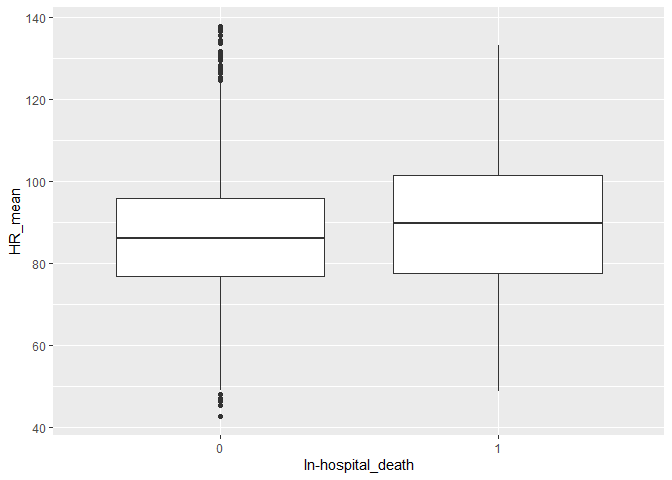
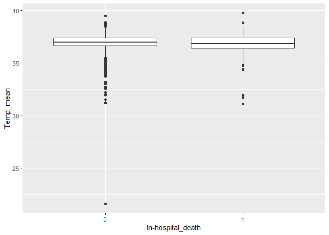
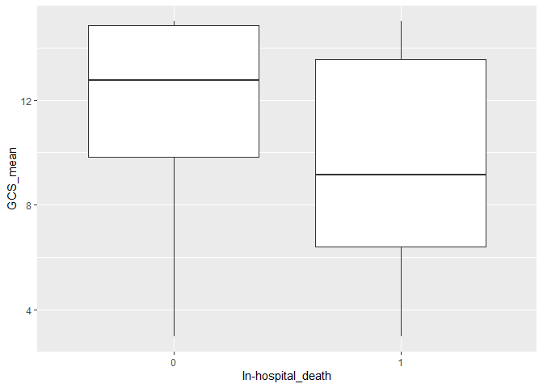
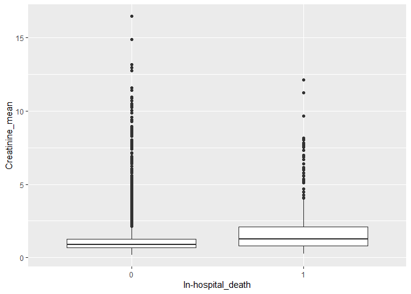
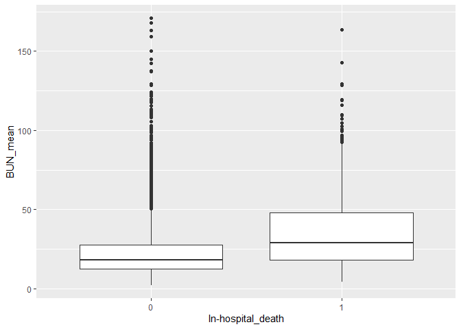
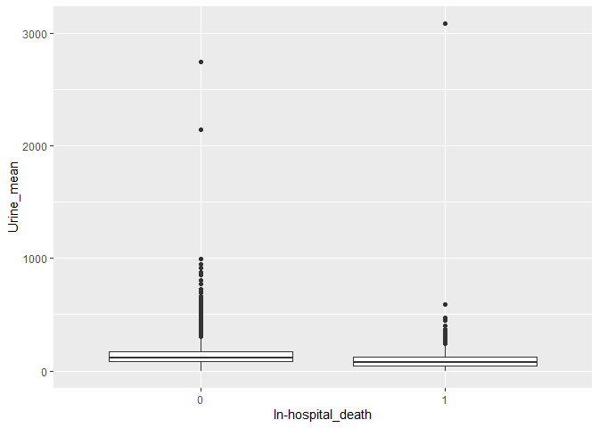
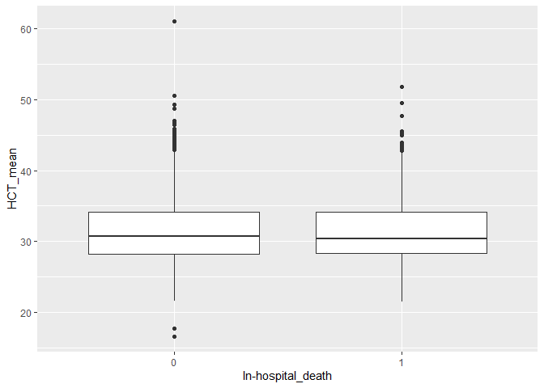
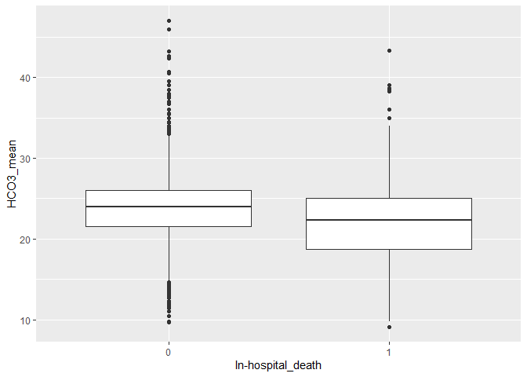
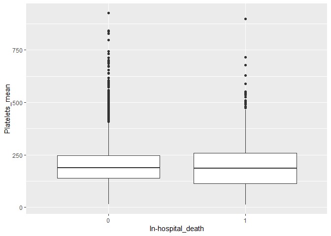
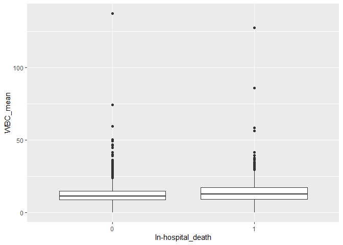

# Introducción: Physionet 2012 UCI data mortality


En el concurso del congreso ["Computers in  Cardiology" (ahora "Computing in Cardiology") del año 2012](https://physionet.org/content/challenge-2012/) propuso un  caso de estudio como reto: *Predicción de la tasa de mortalidad de los pacientes de una UCI*

Resto de años mas recientes 

* https://physionet.org/content/challenge-2018/
* https://physionet.org/content/challenge-2019/


##   Enlaces de interés

[**HR**: Heart Rate bpm beats per minut](https://en.wikipedia.org/wiki/Heart_rate)

[**GCS**: Glasgow Comma Score (scale 3-15)](https://en.wikipedia.org/wiki/Glasgow_Coma_Scale)

[**RespRate**:  Respiration rate (bpm) breaths for one minute](https://en.wikipedia.org/wiki/Respiratory_rate)


#  Ingesta de datos


## Modelo de datos 


```r
# Cargamos los datos
path = "data_basic_physionet/set-a/"# path training
# Creamos un vector con los nombres de los archivos
lista_pacientes_set_a = dir(path) # lista  ficheros pacientes 
# Printamos número de archivos que leemos
length(lista_pacientes_set_a) # número pacientes en training
```

```
## [1] 4000
```

```r
# Mostramos como ejemplo el nombre del documento 1 de los datos 
lista_pacientes_set_a[1]
```

```
## [1] "132539.txt"
```


```
data_paciente_132539=read_csv("data_basic_physionet/set-a/132539.txt", col_types =cols(Time=col_time(format="%M:%S"),Parameter=col_character(),
Value=col_double()))
str(data_paciente_132539)
glimpse(data_paciente_132539)
class(data_paciente_132539)
head(data_paciente_132539,30)
```

## Carga set_a


```r
# lista path's  a cada  ficjero de paciente
list_files = paste0(path,lista_pacientes_set_a)
# Función leer paciente
# Leemos el tiempo como carácter y después haremos un ajuste que nos lo simplifique todo a minutos.  
leer_paciente = function(file){read_csv(file, col_types = cols(Time = col_character(),
                                                               Parameter = col_character(),
                                                               Value = col_double())) %>%
# Separamos las horas de los minutos de la columna Time para acto seguido poner una sola columna 
# llamada Time_min sólo con los minutos en que se tomaron los datos.
                              separate(Time,into = c("H","M"),sep = ":") %>% 
                              mutate(Time_Minutes = as.numeric(H)*60+as.numeric(M)) %>% 
                              select(Time_Minutes,Parameter,Value)}

#leer_paciente(list_files[1])
raw_data = lapply(list_files,leer_paciente)# lista de los datos por paciente
#extraer perfiles "RecordID" "Age"      "Gender"   "Height"   "Weight"   "ICUType" 
perfil = function(data_paciente){
            data_paciente %>%
            filter(Parameter %in% c("RecordID","Age","Gender","Height","ICUType","Weight")) %>%
            select(-Time_Minutes) %>%
            distinct(Parameter,.keep_all = TRUE) %>%
            spread(Parameter,Value) }
## ejemplo
#perfil(data_paciente_132539)
## Guardo  todos los datos  del perfil de cada paciente
perfiles =  lapply(raw_data,perfil) %>%
            bind_rows() %>%
            select(RecordID, Age, Gender, Height,Weight,ICUType)

glimpse(perfiles)
```

```
## Observations: 4,000
## Variables: 6
## $ RecordID <dbl> 132539, 132540, 132541, 132543, 132545, 132547, 13254...
## $ Age      <dbl> 54, 76, 44, 68, 88, 64, 68, 78, 64, 74, 64, 71, 66, 8...
## $ Gender   <dbl> 0, 1, 0, 1, 0, 1, 0, 0, 0, 1, 0, 0, 0, 1, 1, 1, 1, 1,...
## $ Height   <dbl> -1.0, 175.3, -1.0, 180.3, -1.0, 180.3, 162.6, 162.6, ...
## $ Weight   <dbl> -1.0, 76.0, 56.7, 84.6, -1.0, 114.0, 87.0, 48.4, 60.7...
## $ ICUType  <dbl> 4, 2, 3, 3, 3, 1, 3, 3, 3, 2, 3, 2, 3, 1, 1, 2, 3, 3,...
```

```r
## Ler series
## se modifica error de time

serie_UCI_parameter <- function(paciente,parameters){ paciente %>%
                                                      arrange(Parameter,Time_Minutes) %>%
                                                      filter(Parameter %in% parameters) %>%
                                                      add_column(RecordID=paciente[1,3]$Value) } 
##ejemplo
parameters = c("HR","RespRate","GCS")
serie_paciente1 = serie_UCI_parameter(raw_data[[1]],parameters)
serie_paciente1
```

```
## # A tibble: 92 x 4
##    Time_Minutes Parameter Value RecordID
##           <dbl> <chr>     <dbl>    <dbl>
##  1            7 GCS          15   132539
##  2          217 GCS          15   132539
##  3          457 GCS          15   132539
##  4          697 GCS          15   132539
##  5          937 GCS          15   132539
##  6         1177 GCS          15   132539
##  7         1417 GCS          15   132539
##  8         1657 GCS          15   132539
##  9         1897 GCS          14   132539
## 10         2137 GCS          15   132539
## # ... with 82 more rows
```

```r
# paso TODOS los parámetros y  apilo 
parameters=c("Albumin","ALP","ALT","AST","Bilirubin","BUN","Cholesterol","Creatinine","DiasABP","FiO2","GCS","Glucose","HCO3","HCT","HR","K","Lactate","Mg","MAP","MechVent","Na","NIDiasABP","NIMAP","NISysABP","PaCO2","PaO2","pH","Platelets","RespRate","SaO2","SysABP","Temp","TropI","TropT","Urine","WBC")
series_parameters = lapply(raw_data,FUN=function(x) serie_UCI_parameter(x,parameters)) %>%
                    bind_rows()
glimpse(series_parameters)
```

```
## Observations: 1,606,254
## Variables: 4
## $ Time_Minutes <dbl> 637, 1987, 637, 1987, 7, 217, 457, 697, 937, 1177...
## $ Parameter    <chr> "BUN", "BUN", "Creatinine", "Creatinine", "GCS", ...
## $ Value        <dbl> 13.0, 8.0, 0.8, 0.7, 15.0, 15.0, 15.0, 15.0, 15.0...
## $ RecordID     <dbl> 132539, 132539, 132539, 132539, 132539, 132539, 1...
```


## En resumen  tenemos


```r
#set-a
glimpse(perfiles)
```

```
## Observations: 4,000
## Variables: 6
## $ RecordID <dbl> 132539, 132540, 132541, 132543, 132545, 132547, 13254...
## $ Age      <dbl> 54, 76, 44, 68, 88, 64, 68, 78, 64, 74, 64, 71, 66, 8...
## $ Gender   <dbl> 0, 1, 0, 1, 0, 1, 0, 0, 0, 1, 0, 0, 0, 1, 1, 1, 1, 1,...
## $ Height   <dbl> -1.0, 175.3, -1.0, 180.3, -1.0, 180.3, 162.6, 162.6, ...
## $ Weight   <dbl> -1.0, 76.0, 56.7, 84.6, -1.0, 114.0, 87.0, 48.4, 60.7...
## $ ICUType  <dbl> 4, 2, 3, 3, 3, 1, 3, 3, 3, 2, 3, 2, 3, 1, 1, 2, 3, 3,...
```

```r
glimpse(series_parameters)
```

```
## Observations: 1,606,254
## Variables: 4
## $ Time_Minutes <dbl> 637, 1987, 637, 1987, 7, 217, 457, 697, 937, 1177...
## $ Parameter    <chr> "BUN", "BUN", "Creatinine", "Creatinine", "GCS", ...
## $ Value        <dbl> 13.0, 8.0, 0.8, 0.7, 15.0, 15.0, 15.0, 15.0, 15.0...
## $ RecordID     <dbl> 132539, 132539, 132539, 132539, 132539, 132539, 1...
```


## Unificar: series, perfiles y scores

Nos faltan los scores clásicos que se utilizan eb las ICU. Estos ewstán el fichero Outcome-a.txt para el set-a


```r
scoresApath = "data_basic_physionet/Outcomes-a.txt"
scoresA = read_csv(scoresApath)
```

```
## Parsed with column specification:
## cols(
##   RecordID = col_double(),
##   `SAPS-I` = col_double(),
##   SOFA = col_double(),
##   Length_of_stay = col_double(),
##   Survival = col_double(),
##   `In-hospital_death` = col_double()
## )
```

```r
glimpse(scoresA)
```

```
## Observations: 4,000
## Variables: 6
## $ RecordID            <dbl> 132539, 132540, 132541, 132543, 132545, 13...
## $ `SAPS-I`            <dbl> 6, 16, 21, 7, 17, 14, 14, 19, 11, 14, 15, ...
## $ SOFA                <dbl> 1, 8, 11, 1, 2, 11, 4, 8, 0, 6, 2, 7, 2, 7...
## $ Length_of_stay      <dbl> 5, 8, 19, 9, 4, 6, 9, 6, 17, 8, 13, 7, 22,...
## $ Survival            <dbl> -1, -1, -1, 575, 918, 1637, -1, 5, 38, -1,...
## $ `In-hospital_death` <dbl> 0, 0, 0, 0, 0, 0, 0, 1, 0, 0, 0, 0, 0, 0, ...
```

```r
Scores_perfilesA = inner_join(perfiles,scoresA,"RecordID")
glimpse(Scores_perfilesA)
```

```
## Observations: 4,000
## Variables: 11
## $ RecordID            <dbl> 132539, 132540, 132541, 132543, 132545, 13...
## $ Age                 <dbl> 54, 76, 44, 68, 88, 64, 68, 78, 64, 74, 64...
## $ Gender              <dbl> 0, 1, 0, 1, 0, 1, 0, 0, 0, 1, 0, 0, 0, 1, ...
## $ Height              <dbl> -1.0, 175.3, -1.0, 180.3, -1.0, 180.3, 162...
## $ Weight              <dbl> -1.0, 76.0, 56.7, 84.6, -1.0, 114.0, 87.0,...
## $ ICUType             <dbl> 4, 2, 3, 3, 3, 1, 3, 3, 3, 2, 3, 2, 3, 1, ...
## $ `SAPS-I`            <dbl> 6, 16, 21, 7, 17, 14, 14, 19, 11, 14, 15, ...
## $ SOFA                <dbl> 1, 8, 11, 1, 2, 11, 4, 8, 0, 6, 2, 7, 2, 7...
## $ Length_of_stay      <dbl> 5, 8, 19, 9, 4, 6, 9, 6, 17, 8, 13, 7, 22,...
## $ Survival            <dbl> -1, -1, -1, 575, 918, 1637, -1, 5, 38, -1,...
## $ `In-hospital_death` <dbl> 0, 0, 0, 0, 0, 0, 0, 1, 0, 0, 0, 0, 0, 0, ...
```


### Extracción factores de las series 

genero una tabla con resumenes de  las variables por paciente: media, desviación típica 


```r
series_summary =  series_parameters %>%
                  group_by(RecordID,Parameter) %>%
                  summarise(count = n(),mean = mean(Value,na.rm = TRUE),
                            sd = sd(Value,na.rm=TRUE)) %>%
                  gather(Stat, Value, count:sd) %>%
                  ungroup() %>%
                  transmute(RecordID,ParameterStat = paste0(Parameter,"_",Stat),Value) %>%
                  spread(ParameterStat, Value)
```


```r
data_tidy = Scores_perfilesA %>% inner_join(series_summary)
```

```
## Joining, by = "RecordID"
```

Elimino NA


```r
aux=which(is.na(data_tidy$Lactate_count))
length(aux)
```

```
## [1] 1814
```

```r
data_tidy2=data_tidy[-aux,]
view(data_tidy2)
```

Dejamos de considerar por demasiados NA's:
- ALP
- Bilirubina
- Lactate
- Resp Rate

```r
contar_nas = function(x){
  sum(is.na(x))
  
}

pocos_nas = function(x){
  for(i in 1:length(x)){
    if(contar_nas(x) >= 1500){
      return(FALSE)
    }
    else{
      return(TRUE)
    }
  }
  
}


#data_tidy3 = drop_na(data_tidy)


primera_seleccion = data_tidy %>%
  apply( 2, pocos_nas)


# VARIABLES CON "POCOS NAS" EN LA VARIABLE COUNT
nombres = names(primera_seleccion[primera_seleccion])
nombres
```

```
##  [1] "RecordID"          "Age"               "Gender"           
##  [4] "Height"            "Weight"            "ICUType"          
##  [7] "SAPS-I"            "SOFA"              "Length_of_stay"   
## [10] "Survival"          "In-hospital_death" "BUN_count"        
## [13] "BUN_mean"          "BUN_sd"            "Creatinine_count" 
## [16] "Creatinine_mean"   "Creatinine_sd"     "DiasABP_count"    
## [19] "DiasABP_mean"      "DiasABP_sd"        "FiO2_count"       
## [22] "FiO2_mean"         "FiO2_sd"           "GCS_count"        
## [25] "GCS_mean"          "GCS_sd"            "Glucose_count"    
## [28] "Glucose_mean"      "Glucose_sd"        "HCO3_count"       
## [31] "HCO3_mean"         "HCO3_sd"           "HCT_count"        
## [34] "HCT_mean"          "HCT_sd"            "HR_count"         
## [37] "HR_mean"           "HR_sd"             "K_count"          
## [40] "K_mean"            "K_sd"              "MAP_count"        
## [43] "MAP_mean"          "MAP_sd"            "MechVent_count"   
## [46] "MechVent_mean"     "MechVent_sd"       "Mg_count"         
## [49] "Mg_mean"           "Mg_sd"             "Na_count"         
## [52] "Na_mean"           "Na_sd"             "NIDiasABP_count"  
## [55] "NIDiasABP_mean"    "NIDiasABP_sd"      "NIMAP_count"      
## [58] "NIMAP_mean"        "NIMAP_sd"          "NISysABP_count"   
## [61] "NISysABP_mean"     "NISysABP_sd"       "PaCO2_count"      
## [64] "PaCO2_mean"        "PaCO2_sd"          "PaO2_count"       
## [67] "PaO2_mean"         "PaO2_sd"           "pH_count"         
## [70] "pH_mean"           "pH_sd"             "Platelets_count"  
## [73] "Platelets_mean"    "Platelets_sd"      "SysABP_count"     
## [76] "SysABP_mean"       "SysABP_sd"         "Temp_count"       
## [79] "Temp_mean"         "Temp_sd"           "Urine_count"      
## [82] "Urine_mean"        "Urine_sd"          "WBC_count"        
## [85] "WBC_mean"          "WBC_sd"
```

```r
primera_seleccion = select(data_tidy, nombres)
View(primera_seleccion)

# DE LAS SELECCIONADAS, MIRAMOS LAS QUE TIENEN MENOS NA'S Y LAS REORDENAMOS PARA ELEGIR LAS 10 PRIMERAS
pepe = select(primera_seleccion, ends_with("sd")) %>% apply(2, contar_nas)

nombres_pocos_nas = sort(pepe)
nombres_pocos_nas
```

```
##         HR_sd       Temp_sd        GCS_sd Creatinine_sd        BUN_sd 
##            61            62            63           107           109 
##      Urine_sd        HCT_sd       HCO3_sd  Platelets_sd        WBC_sd 
##           121           128           146           159           173 
##         Na_sd          K_sd         Mg_sd    Glucose_sd   NISysABP_sd 
##           177           243           307           320           642 
##  NIDiasABP_sd      NIMAP_sd    DiasABP_sd     SysABP_sd        MAP_sd 
##           645           649          1216          1216          1225 
##         pH_sd      PaCO2_sd       PaO2_sd       FiO2_sd   MechVent_sd 
##          1276          1292          1295          1353          1490
```

```r
nombres_def = nombres_pocos_nas[1:10]
nombres_def
```

```
##         HR_sd       Temp_sd        GCS_sd Creatinine_sd        BUN_sd 
##            61            62            63           107           109 
##      Urine_sd        HCT_sd       HCO3_sd  Platelets_sd        WBC_sd 
##           121           128           146           159           173
```

```r
# SOLUCION CUTRE

data_real_tidy = select(data_tidy, contains("RecordID"),  contains("Age"),  contains("Gender"),  contains("Height"),  contains("Weight"),  contains("ICUType"),  contains("SAPS-I"),  contains("SOFA"),  contains("Length_of_stay"),  contains("Susrvival"),  contains("In-hospital_death"), contains("HR"), contains("Temp"), contains("GCS"), contains("Creatinine"),  contains("BUN"),  contains("Urine"),  contains("HCT"),  contains("HCO3"),  contains("Platelets"),  contains("WBC"))


drop_na(data_real_tidy)
```

```
## # A tibble: 3,676 x 40
##    RecordID   Age Gender Height Weight ICUType `SAPS-I`  SOFA
##       <dbl> <dbl>  <dbl>  <dbl>  <dbl>   <dbl>    <dbl> <dbl>
##  1   132539    54      0    -1    -1         4        6     1
##  2   132540    76      1   175.   76         2       16     8
##  3   132541    44      0    -1    56.7       3       21    11
##  4   132543    68      1   180.   84.6       3        7     1
##  5   132545    88      0    -1    -1         3       17     2
##  6   132547    64      1   180.  114         1       14    11
##  7   132548    68      0   163.   87         3       14     4
##  8   132551    78      0   163.   48.4       3       19     8
##  9   132555    74      1   175.   66.1       2       14     6
## 10   132556    64      0    -1    65         3       15     2
## # ... with 3,666 more rows, and 32 more variables: Length_of_stay <dbl>,
## #   `In-hospital_death` <dbl>, HR_count <dbl>, HR_mean <dbl>, HR_sd <dbl>,
## #   Temp_count <dbl>, Temp_mean <dbl>, Temp_sd <dbl>, GCS_count <dbl>,
## #   GCS_mean <dbl>, GCS_sd <dbl>, Creatinine_count <dbl>,
## #   Creatinine_mean <dbl>, Creatinine_sd <dbl>, BUN_count <dbl>,
## #   BUN_mean <dbl>, BUN_sd <dbl>, Urine_count <dbl>, Urine_mean <dbl>,
## #   Urine_sd <dbl>, HCT_count <dbl>, HCT_mean <dbl>, HCT_sd <dbl>,
## #   HCO3_count <dbl>, HCO3_mean <dbl>, HCO3_sd <dbl>,
## #   Platelets_count <dbl>, Platelets_mean <dbl>, Platelets_sd <dbl>,
## #   WBC_count <dbl>, WBC_mean <dbl>, WBC_sd <dbl>
```

```r
#las que tengan mayores diferencias con las muertes de los in hospital death

#comparaciones con un t.test, per saber si ses mitjanes son iguales o no, si soln iguales FUERA
```


```r
test_varianzas = function(columna){
  # hip nula : varianzas iguales
  # hip alternativa : diferentes 
  x = var.test(columna[data_real_tidy$`In-hospital_death` == 0],
               columna[data_real_tidy$`In-hospital_death` == 1])
  alpha = x$p.value
  if(alpha < 0.05){
    print('Rechazamos: Las varianzas son diferentes')
  }
  else{
    print('Aceptamos: Las varianzas son iguales')
  }
    
}

test_medias = function(columna){
  # hip nula : medias son iguales 
  # hip alternativa: se indica en alternative = c("two.sided", "less", "greater")
  x = t.test(columna[data_real_tidy$`In-hospital_death`==0],
             columna[data_real_tidy$`In-hospital_death`==1],
             var.equal = TRUE)
  alpha = x$p.value
  if(alpha < 0.05){
    print('Rechazamos: Las medias son diferentes')
  }
  else{
    print('Aceptamos: Las medias son iguales')
  }
    
}


# SELECCIÓN 5 VARIABLES MÁS RELEVANTES PARA PREDECIR LA MUERTE

data_real_tidy$`In-hospital_death` = factor(data_real_tidy$`In-hospital_death`, labels = c("0","1"))

# LATIDO CORAZON ----------------------------------------------------------------------------------------
data_real_tidy %>%
  ggplot() +
  geom_boxplot(aes( x = `In-hospital_death`, y = HR_mean))
```

```
## Warning: Removed 60 rows containing non-finite values (stat_boxplot).
```

<!-- -->

```r
test_varianzas(data_real_tidy$HR_mean)
```

```
## [1] "Rechazamos: Las varianzas son diferentes"
```

```r
test_medias(data_real_tidy$HR_mean)
```

```
## [1] "Rechazamos: Las medias son diferentes"
```

```r
# TEMPERATURA ----------------------------------------------------------------------------------------
data_real_tidy %>%
  ggplot() +
  geom_boxplot(aes( x = `In-hospital_death`, y = Temp_mean))
```

```
## Warning: Removed 61 rows containing non-finite values (stat_boxplot).
```

<!-- -->

```r
test_varianzas(data_real_tidy$Temp_mean)
```

```
## [1] "Rechazamos: Las varianzas son diferentes"
```

```r
test_medias(data_real_tidy$Temp_mean)
```

```
## [1] "Rechazamos: Las medias son diferentes"
```

```r
# GLASGOW ----------------------------------------------------------------------------------------
data_real_tidy %>%
  ggplot() +
  geom_boxplot(aes( x = `In-hospital_death`, y = GCS_mean))
```

```
## Warning: Removed 61 rows containing non-finite values (stat_boxplot).
```

<!-- -->

```r
test_varianzas(data_real_tidy$GCS_mean)
```

```
## [1] "Rechazamos: Las varianzas son diferentes"
```

```r
test_medias(data_real_tidy$GCS_mean)
```

```
## [1] "Rechazamos: Las medias son diferentes"
```

```r
# CREATININA ----------------------------------------------------------------------------------------
data_real_tidy %>%
  ggplot() +
  geom_boxplot(aes( x = `In-hospital_death`, y = Creatinine_mean))
```

```
## Warning: Removed 61 rows containing non-finite values (stat_boxplot).
```

<!-- -->

```r
test_varianzas(data_real_tidy$Creatinine_mean)
```

```
## [1] "Rechazamos: Las varianzas son diferentes"
```

```r
test_medias(data_real_tidy$Creatinine_mean)
```

```
## [1] "Rechazamos: Las medias son diferentes"
```

```r
# NITROGENO EN SANGRE ----------------------------------------------------------------------------------------
data_real_tidy %>%
  ggplot() +
  geom_boxplot(aes( x = `In-hospital_death`, y = BUN_mean))
```

```
## Warning: Removed 61 rows containing non-finite values (stat_boxplot).
```

<!-- -->

```r
test_varianzas(data_real_tidy$BUN_mean)
```

```
## [1] "Rechazamos: Las varianzas son diferentes"
```

```r
test_medias(data_real_tidy$BUN_mean)
```

```
## [1] "Rechazamos: Las medias son diferentes"
```

```r
# ORINA ----------------------------------------------------------------------------------------
data_real_tidy %>%
  ggplot() +
  geom_boxplot(aes( x = `In-hospital_death`, y = Urine_mean))
```

```
## Warning: Removed 114 rows containing non-finite values (stat_boxplot).
```

<!-- -->

```r
test_varianzas(data_real_tidy$Urine_mean)
```

```
## [1] "Rechazamos: Las varianzas son diferentes"
```

```r
test_medias(data_real_tidy$Urine_mean)
```

```
## [1] "Rechazamos: Las medias son diferentes"
```

```r
# HEMATOCRITO ----------------------------------------------------------------------------------------
data_real_tidy %>%
  ggplot() +
  geom_boxplot(aes( x = `In-hospital_death`, y = HCT_mean))
```

```
## Warning: Removed 61 rows containing non-finite values (stat_boxplot).
```

<!-- -->

```r
test_varianzas(data_real_tidy$HCT_mean)
```

```
## [1] "Aceptamos: Las varianzas son iguales"
```

```r
test_medias(data_real_tidy$HCT_mean)
```

```
## [1] "Aceptamos: Las medias son iguales"
```

```r
# SERUM BICARBONADO ----------------------------------------------------------------------------------------
data_real_tidy %>%
  ggplot() +
  geom_boxplot(aes( x = `In-hospital_death`, y = HCO3_mean))
```

```
## Warning: Removed 73 rows containing non-finite values (stat_boxplot).
```

<!-- -->

```r
test_varianzas(data_real_tidy$HCO3_mean)
```

```
## [1] "Rechazamos: Las varianzas son diferentes"
```

```r
test_medias(data_real_tidy$HCO3_mean)
```

```
## [1] "Rechazamos: Las medias son diferentes"
```

```r
# PLAQUETAS ----------------------------------------------------------------------------------------
data_real_tidy %>%
  ggplot() +
  geom_boxplot(aes( x = `In-hospital_death`, y = Platelets_mean))
```

```
## Warning: Removed 65 rows containing non-finite values (stat_boxplot).
```

<!-- -->

```r
test_varianzas(data_real_tidy$Platelets_mean)
```

```
## [1] "Rechazamos: Las varianzas son diferentes"
```

```r
test_medias(data_real_tidy$Platelets_mean)
```

```
## [1] "Aceptamos: Las medias son iguales"
```

```r
# GLOBULOS BLANCOS SANGRE ----------------------------------------------------------------------------------------
data_real_tidy %>%
  ggplot() +
  geom_boxplot(aes( x = `In-hospital_death`, y = WBC_mean))
```

```
## Warning: Removed 70 rows containing non-finite values (stat_boxplot).
```

<!-- -->

```r
test_varianzas(data_real_tidy$WBC_mean)
```

```
## [1] "Rechazamos: Las varianzas son diferentes"
```

```r
test_medias(data_real_tidy$WBC_mean)
```

```
## [1] "Rechazamos: Las medias son diferentes"
```


```
hola= series_parameters %>% spread(Parameter,Value)
import=c()
chart.Correlation(hola[], histogram=TRUE, pch=19)
```

