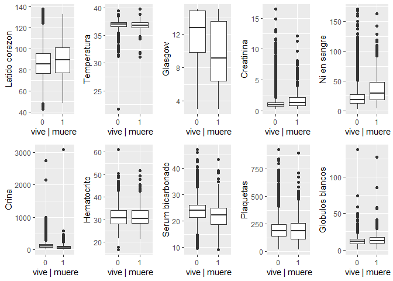
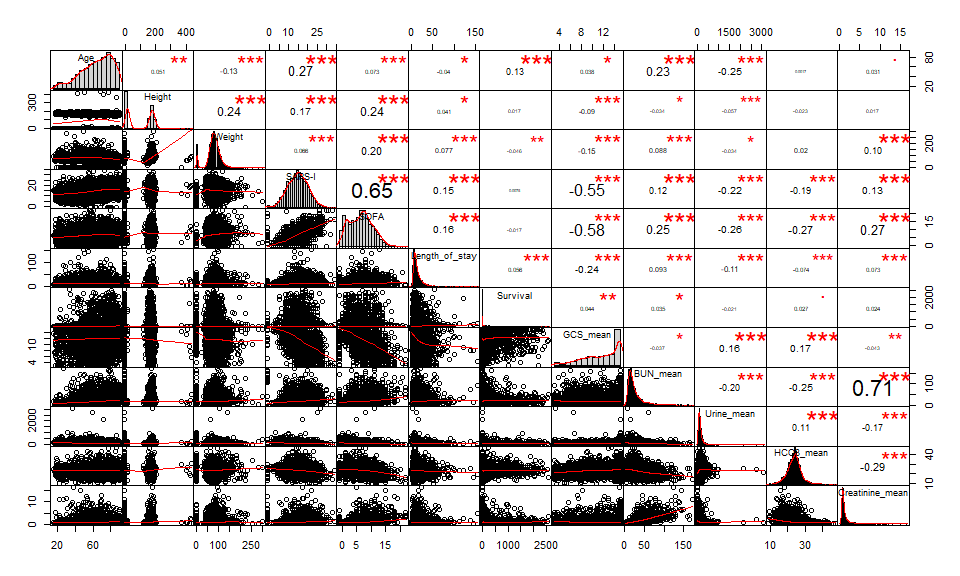
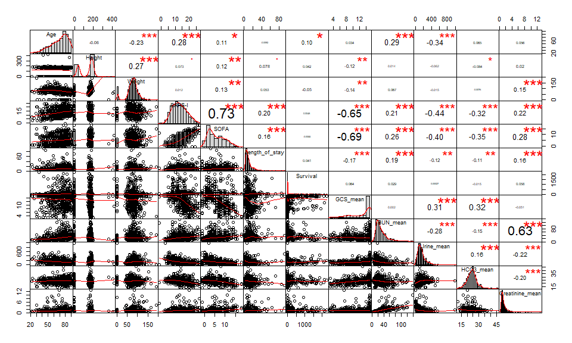
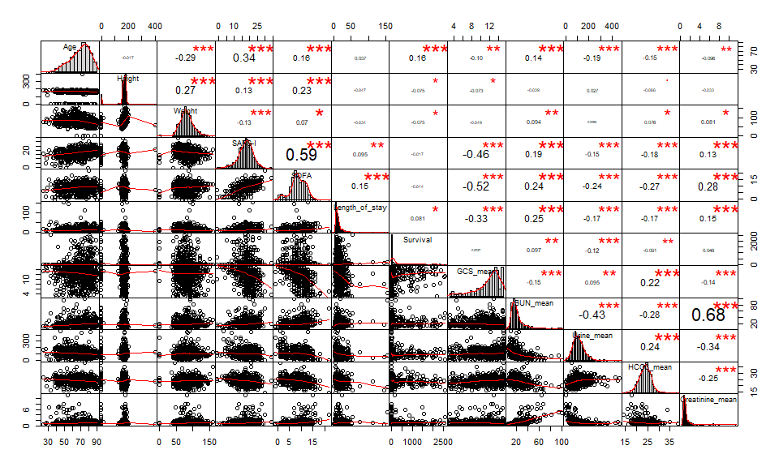
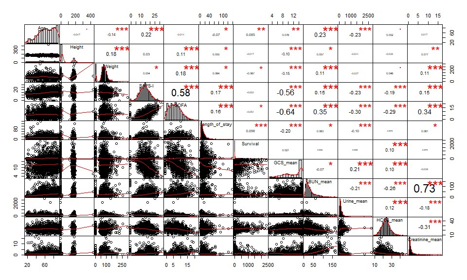

# Introducción: Physionet 2012 UCI data mortality


En el concurso del congreso ["Computers in  Cardiology" (ahora "Computing in Cardiology") del año 2012](https://physionet.org/content/challenge-2012/) propuso un  caso de estudio como reto: *Predicción de la tasa de mortalidad de los pacientes de una UCI*

Resto de años mas recientes 

* https://physionet.org/content/challenge-2018/
* https://physionet.org/content/challenge-2019/


##   Enlaces de interés

[**HR**: Heart Rate bpm beats per minut](https://en.wikipedia.org/wiki/Heart_rate)

[**GCS**: Glasgow Comma Score (scale 3-15)](https://en.wikipedia.org/wiki/Glasgow_Coma_Scale)

[**RespRate**:  Respiration rate (bpm) breaths for one minute](https://en.wikipedia.org/wiki/Respiratory_rate)


#  Ingesta de datos


## Modelo de datos 


```r
# Cargamos los datos
path = "data_basic_physionet/set-a/"# path training
# Creamos un vector con los nombres de los archivos
lista_pacientes_set_a = dir(path) # lista  ficheros pacientes 
# Printamos número de archivos que leemos
length(lista_pacientes_set_a) # número pacientes en training
```

```
## [1] 4000
```

```r
# Mostramos como ejemplo el nombre del documento 1 de los datos 
lista_pacientes_set_a[1]
```

```
## [1] "132539.txt"
```
## Descripción de las variables

- `Edad`

- `Género`

- `Tipo UCI`

- `SAPSI` ("Simplified Acute Physiology Score" estima la probabilitat de mortalitat del pacient d'UCI.)

- `SOFA` ("Sequential Organ Failure Assessment"  Es utilizado para seguir el estado del paciente durante su estadía en la Unidad de UC.)

- `LOS`

- `Survival`

- `In-hospital-death`


```
data_paciente_132539=read_csv("data_basic_physionet/set-a/132539.txt", col_types =cols(Time=col_time(format="%M:%S"),Parameter=col_character(),
Value=col_double()))
str(data_paciente_132539)
glimpse(data_paciente_132539)
class(data_paciente_132539)
head(data_paciente_132539,30)
```

## Carga set_a


```r
# lista path's  a cada  ficjero de paciente
list_files = paste0(path,lista_pacientes_set_a)
# Función leer paciente
# Leemos el tiempo como carácter y después haremos un ajuste que nos lo simplifique todo a minutos.  
leer_paciente = function(file){read_csv(file, col_types = cols(Time = col_character(),
                                                               Parameter = col_character(),
                                                               Value = col_double())) %>%
# Separamos las horas de los minutos de la columna Time para acto seguido poner una sola columna 
# llamada Time_min sólo con los minutos en que se tomaron los datos.
                              separate(Time,into = c("H","M"),sep = ":") %>% 
                              mutate(Time_Minutes = as.numeric(H)*60+as.numeric(M)) %>% 
                              select(Time_Minutes,Parameter,Value)}

#leer_paciente(list_files[1])
raw_data = lapply(list_files,leer_paciente) # lista de los datos por paciente

#extraer perfiles "RecordID" "Age"  "Gender"   "Height"   "Weight"   "ICUType" 
perfil = function(data_paciente){
            data_paciente %>%
            filter(Parameter %in% c("RecordID","Age","Gender","Height","ICUType","Weight")) %>%
            select(-Time_Minutes) %>%
            distinct(Parameter,.keep_all = TRUE) %>%
            spread(Parameter,Value) }
## ejemplo
#perfil(data_paciente_132539)
## Guardo  todos los datos  del perfil de cada paciente
perfiles =  lapply(raw_data,perfil) %>%
            bind_rows() %>%
            select(RecordID, Age, Gender, Height,Weight,ICUType)

glimpse(perfiles) # Printamos la funcion
```

```
## Observations: 4,000
## Variables: 6
## $ RecordID <dbl> 132539, 132540, 132541, 132543, 132545, 132547, 13254...
## $ Age      <dbl> 54, 76, 44, 68, 88, 64, 68, 78, 64, 74, 64, 71, 66, 8...
## $ Gender   <dbl> 0, 1, 0, 1, 0, 1, 0, 0, 0, 1, 0, 0, 0, 1, 1, 1, 1, 1,...
## $ Height   <dbl> -1.0, 175.3, -1.0, 180.3, -1.0, 180.3, 162.6, 162.6, ...
## $ Weight   <dbl> -1.0, 76.0, 56.7, 84.6, -1.0, 114.0, 87.0, 48.4, 60.7...
## $ ICUType  <dbl> 4, 2, 3, 3, 3, 1, 3, 3, 3, 2, 3, 2, 3, 1, 1, 2, 3, 3,...
```

```r
# Arreglamos el error de time
serie_UCI_parameter <- function(paciente,parameters){ paciente %>%
                                                      arrange(Parameter,Time_Minutes) %>%
                                                      filter(Parameter %in% parameters) %>%
                                                      add_column(RecordID = paciente[1,3]$Value) } 
##ejemplo
parameters = c("HR","RespRate","GCS")
serie_paciente1 = serie_UCI_parameter(raw_data[[1]],parameters)
serie_paciente1
```

```
## # A tibble: 92 x 4
##    Time_Minutes Parameter Value RecordID
##           <dbl> <chr>     <dbl>    <dbl>
##  1            7 GCS          15   132539
##  2          217 GCS          15   132539
##  3          457 GCS          15   132539
##  4          697 GCS          15   132539
##  5          937 GCS          15   132539
##  6         1177 GCS          15   132539
##  7         1417 GCS          15   132539
##  8         1657 GCS          15   132539
##  9         1897 GCS          14   132539
## 10         2137 GCS          15   132539
## # ... with 82 more rows
```

```r
# paso TODOS los parámetros y  apilo 
parameters=c("Albumin","ALP","ALT","AST","Bilirubin","BUN","Cholesterol","Creatinine","DiasABP","FiO2","GCS","Glucose","HCO3","HCT","HR","K","Lactate","Mg","MAP","MechVent","Na","NIDiasABP","NIMAP","NISysABP","PaCO2","PaO2","pH","Platelets","RespRate","SaO2","SysABP","Temp","TropI","TropT","Urine","WBC")
series_parameters = lapply(raw_data,FUN=function(x) serie_UCI_parameter(x,parameters)) %>%
                    bind_rows()

glimpse(series_parameters) # Printamos la función
```

```
## Observations: 1,606,254
## Variables: 4
## $ Time_Minutes <dbl> 637, 1987, 637, 1987, 7, 217, 457, 697, 937, 1177...
## $ Parameter    <chr> "BUN", "BUN", "Creatinine", "Creatinine", "GCS", ...
## $ Value        <dbl> 13.0, 8.0, 0.8, 0.7, 15.0, 15.0, 15.0, 15.0, 15.0...
## $ RecordID     <dbl> 132539, 132539, 132539, 132539, 132539, 132539, 1...
```


## En resumen  tenemos


```r
#set-a
glimpse(perfiles)
```

```
## Observations: 4,000
## Variables: 6
## $ RecordID <dbl> 132539, 132540, 132541, 132543, 132545, 132547, 13254...
## $ Age      <dbl> 54, 76, 44, 68, 88, 64, 68, 78, 64, 74, 64, 71, 66, 8...
## $ Gender   <dbl> 0, 1, 0, 1, 0, 1, 0, 0, 0, 1, 0, 0, 0, 1, 1, 1, 1, 1,...
## $ Height   <dbl> -1.0, 175.3, -1.0, 180.3, -1.0, 180.3, 162.6, 162.6, ...
## $ Weight   <dbl> -1.0, 76.0, 56.7, 84.6, -1.0, 114.0, 87.0, 48.4, 60.7...
## $ ICUType  <dbl> 4, 2, 3, 3, 3, 1, 3, 3, 3, 2, 3, 2, 3, 1, 1, 2, 3, 3,...
```

```r
glimpse(series_parameters)
```

```
## Observations: 1,606,254
## Variables: 4
## $ Time_Minutes <dbl> 637, 1987, 637, 1987, 7, 217, 457, 697, 937, 1177...
## $ Parameter    <chr> "BUN", "BUN", "Creatinine", "Creatinine", "GCS", ...
## $ Value        <dbl> 13.0, 8.0, 0.8, 0.7, 15.0, 15.0, 15.0, 15.0, 15.0...
## $ RecordID     <dbl> 132539, 132539, 132539, 132539, 132539, 132539, 1...
```


## Unificar: series, perfiles y scores

Nos faltan los scores clásicos que se utilizan eb las ICU. Estos ewstán el fichero Outcome-a.txt para el set-a


```r
scoresApath = "data_basic_physionet/Outcomes-a.txt"
scoresA = read_csv(scoresApath)
```

```
## Parsed with column specification:
## cols(
##   RecordID = col_double(),
##   `SAPS-I` = col_double(),
##   SOFA = col_double(),
##   Length_of_stay = col_double(),
##   Survival = col_double(),
##   `In-hospital_death` = col_double()
## )
```

```r
glimpse(scoresA)
```

```
## Observations: 4,000
## Variables: 6
## $ RecordID            <dbl> 132539, 132540, 132541, 132543, 132545, 13...
## $ `SAPS-I`            <dbl> 6, 16, 21, 7, 17, 14, 14, 19, 11, 14, 15, ...
## $ SOFA                <dbl> 1, 8, 11, 1, 2, 11, 4, 8, 0, 6, 2, 7, 2, 7...
## $ Length_of_stay      <dbl> 5, 8, 19, 9, 4, 6, 9, 6, 17, 8, 13, 7, 22,...
## $ Survival            <dbl> -1, -1, -1, 575, 918, 1637, -1, 5, 38, -1,...
## $ `In-hospital_death` <dbl> 0, 0, 0, 0, 0, 0, 0, 1, 0, 0, 0, 0, 0, 0, ...
```

```r
Scores_perfilesA = inner_join(perfiles,scoresA,"RecordID")
glimpse(Scores_perfilesA)
```

```
## Observations: 4,000
## Variables: 11
## $ RecordID            <dbl> 132539, 132540, 132541, 132543, 132545, 13...
## $ Age                 <dbl> 54, 76, 44, 68, 88, 64, 68, 78, 64, 74, 64...
## $ Gender              <dbl> 0, 1, 0, 1, 0, 1, 0, 0, 0, 1, 0, 0, 0, 1, ...
## $ Height              <dbl> -1.0, 175.3, -1.0, 180.3, -1.0, 180.3, 162...
## $ Weight              <dbl> -1.0, 76.0, 56.7, 84.6, -1.0, 114.0, 87.0,...
## $ ICUType             <dbl> 4, 2, 3, 3, 3, 1, 3, 3, 3, 2, 3, 2, 3, 1, ...
## $ `SAPS-I`            <dbl> 6, 16, 21, 7, 17, 14, 14, 19, 11, 14, 15, ...
## $ SOFA                <dbl> 1, 8, 11, 1, 2, 11, 4, 8, 0, 6, 2, 7, 2, 7...
## $ Length_of_stay      <dbl> 5, 8, 19, 9, 4, 6, 9, 6, 17, 8, 13, 7, 22,...
## $ Survival            <dbl> -1, -1, -1, 575, 918, 1637, -1, 5, 38, -1,...
## $ `In-hospital_death` <dbl> 0, 0, 0, 0, 0, 0, 0, 1, 0, 0, 0, 0, 0, 0, ...
```


### Extracción factores de las series 

genero una tabla con resumenes de  las variables por paciente: media, desviación típica 


```r
series_summary =  series_parameters %>%
                  group_by(RecordID,Parameter) %>%
                  summarise(count = n(),mean = mean(Value,na.rm = TRUE),
                            sd = sd(Value,na.rm=TRUE)) %>%
                  gather(Stat, Value, count:sd) %>%
                  ungroup() %>%
                  transmute(RecordID,ParameterStat = paste0(Parameter,"_",Stat),Value) %>%
                  spread(ParameterStat, Value)
```


```r
data_tidy = Scores_perfilesA %>% inner_join(series_summary)
```

```
## Joining, by = "RecordID"
```

## LIMPIEZA NA's


```r
aux = which(is.na(data_tidy$Lactate_count))
length(aux)
```

```
## [1] 1814
```

```r
data_tidy2 = data_tidy[-aux,]
#view(data_tidy2)
```

Dejamos de considerar por demasiados NA's:
- ALP
- Bilirubina
- Lactate
- Resp Rate


```r
#Definimos una función que nos cuente el número de NA's en una variable x
contar_nas = function(x){
  sum(is.na(x))
}

#Definimos un programa que la variable x marque TRUE cuando tiene menos de 1500 NA's
pocos_nas = function(x){
  for(i in 1:length(x)){
    if(contar_nas(x) >= 1500){
      return(FALSE)
    }
    else{
      return(TRUE)
    }
  }
}


#data_tidy3 = drop_na(data_tidy)

#Aplicamos la función de TRUE o FALSE para saber qué variables pasan el umbral de 1500 NA's y cuáles no
seleccion_pocos_nas = data_tidy %>%
  apply( 2, pocos_nas)


# Guardamos sólo los nombres de las variables que en "<VARIABLE>_count" está por debajo los 1500 NA's
nombres = names(seleccion_pocos_nas[seleccion_pocos_nas])
nombres
```

```
##  [1] "RecordID"          "Age"               "Gender"           
##  [4] "Height"            "Weight"            "ICUType"          
##  [7] "SAPS-I"            "SOFA"              "Length_of_stay"   
## [10] "Survival"          "In-hospital_death" "BUN_count"        
## [13] "BUN_mean"          "BUN_sd"            "Creatinine_count" 
## [16] "Creatinine_mean"   "Creatinine_sd"     "DiasABP_count"    
## [19] "DiasABP_mean"      "DiasABP_sd"        "FiO2_count"       
## [22] "FiO2_mean"         "FiO2_sd"           "GCS_count"        
## [25] "GCS_mean"          "GCS_sd"            "Glucose_count"    
## [28] "Glucose_mean"      "Glucose_sd"        "HCO3_count"       
## [31] "HCO3_mean"         "HCO3_sd"           "HCT_count"        
## [34] "HCT_mean"          "HCT_sd"            "HR_count"         
## [37] "HR_mean"           "HR_sd"             "K_count"          
## [40] "K_mean"            "K_sd"              "MAP_count"        
## [43] "MAP_mean"          "MAP_sd"            "MechVent_count"   
## [46] "MechVent_mean"     "MechVent_sd"       "Mg_count"         
## [49] "Mg_mean"           "Mg_sd"             "Na_count"         
## [52] "Na_mean"           "Na_sd"             "NIDiasABP_count"  
## [55] "NIDiasABP_mean"    "NIDiasABP_sd"      "NIMAP_count"      
## [58] "NIMAP_mean"        "NIMAP_sd"          "NISysABP_count"   
## [61] "NISysABP_mean"     "NISysABP_sd"       "PaCO2_count"      
## [64] "PaCO2_mean"        "PaCO2_sd"          "PaO2_count"       
## [67] "PaO2_mean"         "PaO2_sd"           "pH_count"         
## [70] "pH_mean"           "pH_sd"             "Platelets_count"  
## [73] "Platelets_mean"    "Platelets_sd"      "SysABP_count"     
## [76] "SysABP_mean"       "SysABP_sd"         "Temp_count"       
## [79] "Temp_mean"         "Temp_sd"           "Urine_count"      
## [82] "Urine_mean"        "Urine_sd"          "WBC_count"        
## [85] "WBC_mean"          "WBC_sd"
```

```r
#Guardamos en un data set nuevo las variables que nos ha interesado seleccionar con el criterio de NA's
primera_seleccion = select(data_tidy, nombres)
```

## SELECCIÓN 10 VARIABLES INICIALES

El criterio de primera selección se basará en considerar las que tengan menos NA's como las más útiles para nuestro estudio.


```r
# DE LAS SELECCIONADAS, MIRAMOS LAS QUE TIENEN MENOS NA'S Y LAS REORDENAMOS PARA ELEGIR LAS 10 PRIMERAS
# Para hacerlo nos fijamos sólo en las variables: "<VARIABLE>_sd" mediante un select
seleccion_menor_nas = select(primera_seleccion, ends_with("sd")) %>% apply(2, contar_nas)
seleccion_menor_nas
```

```
##        BUN_sd Creatinine_sd    DiasABP_sd       FiO2_sd        GCS_sd 
##           109           107          1216          1353            63 
##    Glucose_sd       HCO3_sd        HCT_sd         HR_sd          K_sd 
##           320           146           128            61           243 
##        MAP_sd   MechVent_sd         Mg_sd         Na_sd  NIDiasABP_sd 
##          1225          1490           307           177           645 
##      NIMAP_sd   NISysABP_sd      PaCO2_sd       PaO2_sd         pH_sd 
##           649           642          1292          1295          1276 
##  Platelets_sd     SysABP_sd       Temp_sd      Urine_sd        WBC_sd 
##           159          1216            62           121           173
```

```r
# LAS REORDENAMOS PARA PODER COGER SÓLO LAS 10 PRIMERAS
nombres_pocos_nas = sort(seleccion_menor_nas)
nombres_pocos_nas
```

```
##         HR_sd       Temp_sd        GCS_sd Creatinine_sd        BUN_sd 
##            61            62            63           107           109 
##      Urine_sd        HCT_sd       HCO3_sd  Platelets_sd        WBC_sd 
##           121           128           146           159           173 
##         Na_sd          K_sd         Mg_sd    Glucose_sd   NISysABP_sd 
##           177           243           307           320           642 
##  NIDiasABP_sd      NIMAP_sd    DiasABP_sd     SysABP_sd        MAP_sd 
##           645           649          1216          1216          1225 
##         pH_sd      PaCO2_sd       PaO2_sd       FiO2_sd   MechVent_sd 
##          1276          1292          1295          1353          1490
```

```r
# COGEMOS LAS 10 PRIMERAS
nombres_def = nombres_pocos_nas[1:10]
nombres_def
```

```
##         HR_sd       Temp_sd        GCS_sd Creatinine_sd        BUN_sd 
##            61            62            63           107           109 
##      Urine_sd        HCT_sd       HCO3_sd  Platelets_sd        WBC_sd 
##           121           128           146           159           173
```

```r
# DE FORMA MANUAL, VOLVEMOS AL DATA SET ORIGINAL Y SELECCIONAMOS LAS 10 VARIABLES DE "nombres_def"
data_real_tidy = select(data_tidy, contains("RecordID"),  contains("Age"),  contains("Gender"),  contains("Height"),  contains("Weight"),  contains("ICUType"),  contains("SAPS-I"),  contains("SOFA"),  contains("Length_of_stay"),  contains("Survival"),  contains("In-hospital_death"), contains("HR"), contains("Temp"), contains("GCS"), contains("Creatinine"),  contains("BUN"),  contains("Urine"),  contains("HCT"),  contains("HCO3"),  contains("Platelets"),  contains("WBC"))

# Eliminamos los na's que todavía hay y vemos que esta vez no desaparecen todos los datos, 
# así pues habremos hecho una limpieza que habrá merecido la pena :)
drop_na(data_real_tidy)
```

```
## # A tibble: 3,676 x 41
##    RecordID   Age Gender Height Weight ICUType `SAPS-I`  SOFA
##       <dbl> <dbl>  <dbl>  <dbl>  <dbl>   <dbl>    <dbl> <dbl>
##  1   132539    54      0    -1    -1         4        6     1
##  2   132540    76      1   175.   76         2       16     8
##  3   132541    44      0    -1    56.7       3       21    11
##  4   132543    68      1   180.   84.6       3        7     1
##  5   132545    88      0    -1    -1         3       17     2
##  6   132547    64      1   180.  114         1       14    11
##  7   132548    68      0   163.   87         3       14     4
##  8   132551    78      0   163.   48.4       3       19     8
##  9   132555    74      1   175.   66.1       2       14     6
## 10   132556    64      0    -1    65         3       15     2
## # ... with 3,666 more rows, and 33 more variables: Length_of_stay <dbl>,
## #   Survival <dbl>, `In-hospital_death` <dbl>, HR_count <dbl>,
## #   HR_mean <dbl>, HR_sd <dbl>, Temp_count <dbl>, Temp_mean <dbl>,
## #   Temp_sd <dbl>, GCS_count <dbl>, GCS_mean <dbl>, GCS_sd <dbl>,
## #   Creatinine_count <dbl>, Creatinine_mean <dbl>, Creatinine_sd <dbl>,
## #   BUN_count <dbl>, BUN_mean <dbl>, BUN_sd <dbl>, Urine_count <dbl>,
## #   Urine_mean <dbl>, Urine_sd <dbl>, HCT_count <dbl>, HCT_mean <dbl>,
## #   HCT_sd <dbl>, HCO3_count <dbl>, HCO3_mean <dbl>, HCO3_sd <dbl>,
## #   Platelets_count <dbl>, Platelets_mean <dbl>, Platelets_sd <dbl>,
## #   WBC_count <dbl>, WBC_mean <dbl>, WBC_sd <dbl>
```

## SELECCIÓN 5 VARIABLES

Para elegir las 5 que nos aporten mas información a la hora de predecir las muertes, realizamos los siguientes boxplots y contrastes de hipótesis para encontrar aquellas que la muerte y la vida tengan más variación.


```r
# Hacemos contraste de hipótesis para saber si deberiamos considerar las
# varianzas iguales o diferentes para el contraste de medias que haremos a continuación.
test_varianzas = function(columna){
  # hip nula : varianzas iguales
  # hip alternativa : diferentes 
  x = var.test(columna[data_real_tidy$`In-hospital_death` == 0],
               columna[data_real_tidy$`In-hospital_death` == 1])
  alpha = x$p.value
  if(alpha < 0.05){
    return(FALSE)
  }
  else{
    return(TRUE)
  }
}

# Hacemos contraste de hipótesis para saber si las medias son iguales o no.
test_medias = function(columna){
  # hip nula : medias son iguales 
  # hip alternativa: se indica en alternative = c("two.sided", "less", "greater")
  x = t.test(columna[data_real_tidy$`In-hospital_death` == 0],
             columna[data_real_tidy$`In-hospital_death` == 1],
             var.equal = test_varianzas(columna)) # Aquí aplicamos la función anterior como habíamos dicho
  return(x$p.value)
}

respuesta_test = function(columna){
  x = t.test(columna[data_real_tidy$`In-hospital_death` == 0],
             columna[data_real_tidy$`In-hospital_death` == 1],
             var.equal = test_varianzas(columna)) # Aplicamos la función anterior para considerar o no var. iguales o diferentes
  alpha = x$p.value
  if(alpha < 0.05){
    print('Rechazamos: Las medias son diferentes')
  }
  else{
    print('Aceptamos: Las medias son iguales <-')
  }
}


# SELECCIÓN 5 VARIABLES MÁS RELEVANTES PARA PREDECIR LA MUERTE
# Para que podamos hacer los boxplot bien, antes debemos hacer factor la columna de "Muertes en el hospital"
data_real_tidy$`In-hospital_death` = factor(data_real_tidy$`In-hospital_death`, labels = c("0","1"))
# Creamos un array "vacio" que contendrá los valores del p.value del test de medias
p_valores = c(1:10)

# LATIDO CORAZON -------------------------------------------------------------------------
p1 <- data_real_tidy %>%
  ggplot() +
  geom_boxplot(aes( x = `In-hospital_death`, y = HR_mean)) +
  labs(x = " vive | muere", y = "Latido corazon")


# Hacemos el test de medias de cada una de las variables
print("Variable: LATIDO CORAZÓN")
```

```
## [1] "Variable: LATIDO CORAZÓN"
```

```r
# Guardamos el p_valor para más tarde considerar las 5 mejores como aquellas con el p_valor más bajo
p_valores[1] = test_medias(data_real_tidy$HR_mean)
# Imprimimos por pantalla la resolución del test de medias (teniendo el de varianzas ya resuelto dentro del de medias)
respuesta_test(data_real_tidy$HR_mean)
```

```
## [1] "Rechazamos: Las medias son diferentes"
```

```r
# TEMPERATURA ----------------------------------------------------------------------------
p2 <- data_real_tidy %>%
  ggplot() +
  geom_boxplot(aes( x = `In-hospital_death`, y = Temp_mean)) +
  labs(x = " vive | muere", y = "Temperatura")

print("Variable: TEMPERATURA")
```

```
## [1] "Variable: TEMPERATURA"
```

```r
p_valores[2] = test_medias(data_real_tidy$Temp_mean)
respuesta_test(data_real_tidy$Temp_mean)
```

```
## [1] "Rechazamos: Las medias son diferentes"
```

```r
# GLASGOW --------------------------------------------------------------------------------
p3 <- data_real_tidy %>%
  ggplot() +
  geom_boxplot(aes( x = `In-hospital_death`, y = GCS_mean)) +
  labs(x = " vive | muere", y = "Glasgow")

print("Variable: GLASGOW")
```

```
## [1] "Variable: GLASGOW"
```

```r
p_valores[3] = test_medias(data_real_tidy$GCS_mean)
respuesta_test(data_real_tidy$GCS_mean)
```

```
## [1] "Rechazamos: Las medias son diferentes"
```

```r
# CREATININA -----------------------------------------------------------------------------
p4 <- data_real_tidy %>%
  ggplot() +
  geom_boxplot(aes( x = `In-hospital_death`, y = Creatinine_mean)) +
  labs(x = " vive | muere", y = "Creatinina")

print("Variable: CREATININA")
```

```
## [1] "Variable: CREATININA"
```

```r
p_valores[4] = test_medias(data_real_tidy$Creatinine_mean)
respuesta_test(data_real_tidy$Creatinine_mean)
```

```
## [1] "Rechazamos: Las medias son diferentes"
```

```r
# NITROGENO EN SANGRE --------------------------------------------------------------------
p5 <- data_real_tidy %>%
  ggplot() +
  geom_boxplot(aes( x = `In-hospital_death`, y = BUN_mean)) +
  labs(x = " vive | muere", y = "Ni en sangre")

print("Variable: NITROGENO EN SANGRE")
```

```
## [1] "Variable: NITROGENO EN SANGRE"
```

```r
p_valores[5] = test_medias(data_real_tidy$BUN_mean)
respuesta_test(data_real_tidy$BUN_mean)
```

```
## [1] "Rechazamos: Las medias son diferentes"
```

```r
# ORINA ----------------------------------------------------------------------------------
p6 <- data_real_tidy %>%
  ggplot() +
  geom_boxplot(aes( x = `In-hospital_death`, y = Urine_mean)) +
  labs(x = " vive | muere", y = "Orina")

print("Variable: ORINA")
```

```
## [1] "Variable: ORINA"
```

```r
p_valores[6] = test_medias(data_real_tidy$Urine_mean)
respuesta_test(data_real_tidy$Urine_mean)
```

```
## [1] "Rechazamos: Las medias son diferentes"
```

```r
# HEMATOCRITO ----------------------------------------------------------------------------
p7 <- data_real_tidy %>%
  ggplot() +
  geom_boxplot(aes( x = `In-hospital_death`, y = HCT_mean)) +
  labs(x = " vive | muere", y = "Hematocrito")

print("Variable: HEMATOCRITO")
```

```
## [1] "Variable: HEMATOCRITO"
```

```r
p_valores[7] = test_medias(data_real_tidy$HCT_mean) # Se acepta que las medias son iguales, así HTC no nos interesa
respuesta_test(data_real_tidy$HCT_mean)
```

```
## [1] "Aceptamos: Las medias son iguales <-"
```

```r
# SERUM BICARBONADO ----------------------------------------------------------------------
p8 <- data_real_tidy %>%
  ggplot() +
  geom_boxplot(aes( x = `In-hospital_death`, y = HCO3_mean)) +
  labs(x = " vive | muere", y = "Serum bicarbonado")

print("Variable: SERUM BICARBONADO")
```

```
## [1] "Variable: SERUM BICARBONADO"
```

```r
p_valores[8] = test_medias(data_real_tidy$HCO3_mean)
respuesta_test(data_real_tidy$HCO3_mean)
```

```
## [1] "Rechazamos: Las medias son diferentes"
```

```r
# PLAQUETAS ------------------------------------------------------------------------------
p9 <- data_real_tidy %>%
  ggplot() +
  geom_boxplot(aes( x = `In-hospital_death`, y = Platelets_mean)) +
  labs(x = " vive | muere", y = "Plaquetas")

print("Variable: PLAQUETAS")
```

```
## [1] "Variable: PLAQUETAS"
```

```r
p_valores[9] = test_medias(data_real_tidy$Platelets_mean) 
respuesta_test(data_real_tidy$Platelets_mean) # Se acepta que las medias son iguales, así Platelets no nos interesa
```

```
## [1] "Aceptamos: Las medias son iguales <-"
```

```r
# GLOBULOS BLANCOS SANGRE ----------------------------------------------------------------
p10 <- data_real_tidy %>%
  ggplot() +
  geom_boxplot(aes( x = `In-hospital_death`, y = WBC_mean)) +
  labs(x = " vive | muere", y = "Globulos blancos")

print("Variable: GLOBULOS BLANCOS EN SANGRE")
```

```
## [1] "Variable: GLOBULOS BLANCOS EN SANGRE"
```

```r
p_valores[10] = test_medias(data_real_tidy$WBC_mean)
respuesta_test(data_real_tidy$WBC_mean)
```

```
## [1] "Rechazamos: Las medias son diferentes"
```

```r
# Imprimimos los boxplot de forma más compacta para ahorrar espacio
grid.arrange(p1,p2,p3,p4,p5,p6,p7,p8,p9,p10, nrow = 2)
```

<!-- -->

Hemos descubierto que Platelets y HTC no vale la pena considerarlos. Falta elegir de entre los 8 restantes, cuales son los que presentan mayor varianza. Ésto se puede ver mejor en los boxplot.

Lo que nos interesa ahora es coger de las que sí presentan diferencias, elegir las que el p-valor sea más bajo ya que serán aquellas que nos aportarán más información.


```r
# Creamos un array que nos guarde los nombres de las 10 variables con las que trabajamos
diez_variables = names(select(data_real_tidy, ends_with("mean")))

# Creamos una tibble que de cada variable nos diga su p-valor en el contraste de medias
tabla_p_valores = as_tibble(data.frame(diez_variables, p_valores))
tabla_p_valores
```

```
## # A tibble: 10 x 2
##    diez_variables  p_valores
##    <fct>               <dbl>
##  1 HR_mean          4.12e- 5
##  2 Temp_mean        6.32e- 4
##  3 GCS_mean         5.19e-39
##  4 Creatinine_mean  6.38e-11
##  5 BUN_mean         1.36e-28
##  6 Urine_mean       4.96e-10
##  7 HCT_mean         5.20e- 1
##  8 HCO3_mean        9.27e-12
##  9 Platelets_mean   2.31e- 1
## 10 WBC_mean         2.43e- 5
```

```r
# Las reordenamos de menor a mayor para quedarnos sólo con las 5 primeras (con el p-valor más bajo)
cinco_variables = arrange(tabla_p_valores,p_valores)[1:5,1]
cinco_variables
```

```
## # A tibble: 5 x 1
##   diez_variables 
##   <fct>          
## 1 GCS_mean       
## 2 BUN_mean       
## 3 HCO3_mean      
## 4 Creatinine_mean
## 5 Urine_mean
```

Ahora que ya sabemos los nombres de las 5 variables que nos ayudarán a hacer un estudio más preciso, creamos la tabla final de datos sólo con estas variables.


```r
# Selecionamos manualmente (como antes) las 5 variables que usaremos durante lo que queda de trabajo
data_real_tidy = select(data_tidy, contains("RecordID"),  contains("Age"),  contains("Gender"),  contains("Height"),  contains("Weight"),  contains("ICUType"),  contains("SAPS-I"),  contains("SOFA"),  contains("Length_of_stay"),  contains("Survival"),  contains("In-hospital_death"), contains("GCS"), contains("BUN"),  contains("Urine"), contains("HCO3"), contains("Creatinine"))

data_real_tidy = drop_na(data_real_tidy)


# Mostramos por pantalla la tabla final
head(data_real_tidy) %>%
  kable() %>%
  kable_styling(bootstrap_options = c("striped", "hover", "condensed")) %>%
  scroll_box(width = "910px")
```

<div style="border: 1px solid #ddd; padding: 5px; overflow-x: scroll; width:910px; "><table class="table table-striped table-hover table-condensed" style="margin-left: auto; margin-right: auto;">
 <thead>
  <tr>
   <th style="text-align:right;"> RecordID </th>
   <th style="text-align:right;"> Age </th>
   <th style="text-align:right;"> Gender </th>
   <th style="text-align:right;"> Height </th>
   <th style="text-align:right;"> Weight </th>
   <th style="text-align:right;"> ICUType </th>
   <th style="text-align:right;"> SAPS-I </th>
   <th style="text-align:right;"> SOFA </th>
   <th style="text-align:right;"> Length_of_stay </th>
   <th style="text-align:right;"> Survival </th>
   <th style="text-align:right;"> In-hospital_death </th>
   <th style="text-align:right;"> GCS_count </th>
   <th style="text-align:right;"> GCS_mean </th>
   <th style="text-align:right;"> GCS_sd </th>
   <th style="text-align:right;"> BUN_count </th>
   <th style="text-align:right;"> BUN_mean </th>
   <th style="text-align:right;"> BUN_sd </th>
   <th style="text-align:right;"> Urine_count </th>
   <th style="text-align:right;"> Urine_mean </th>
   <th style="text-align:right;"> Urine_sd </th>
   <th style="text-align:right;"> HCO3_count </th>
   <th style="text-align:right;"> HCO3_mean </th>
   <th style="text-align:right;"> HCO3_sd </th>
   <th style="text-align:right;"> Creatinine_count </th>
   <th style="text-align:right;"> Creatinine_mean </th>
   <th style="text-align:right;"> Creatinine_sd </th>
  </tr>
 </thead>
<tbody>
  <tr>
   <td style="text-align:right;"> 132539 </td>
   <td style="text-align:right;"> 54 </td>
   <td style="text-align:right;"> 0 </td>
   <td style="text-align:right;"> -1.0 </td>
   <td style="text-align:right;"> -1.0 </td>
   <td style="text-align:right;"> 4 </td>
   <td style="text-align:right;"> 6 </td>
   <td style="text-align:right;"> 1 </td>
   <td style="text-align:right;"> 5 </td>
   <td style="text-align:right;"> -1 </td>
   <td style="text-align:right;"> 0 </td>
   <td style="text-align:right;"> 13 </td>
   <td style="text-align:right;"> 14.923077 </td>
   <td style="text-align:right;"> 0.2773501 </td>
   <td style="text-align:right;"> 2 </td>
   <td style="text-align:right;"> 10.500000 </td>
   <td style="text-align:right;"> 3.535534 </td>
   <td style="text-align:right;"> 38 </td>
   <td style="text-align:right;"> 171.05263 </td>
   <td style="text-align:right;"> 171.87031 </td>
   <td style="text-align:right;"> 2 </td>
   <td style="text-align:right;"> 27.00000 </td>
   <td style="text-align:right;"> 1.4142136 </td>
   <td style="text-align:right;"> 2 </td>
   <td style="text-align:right;"> 0.7500000 </td>
   <td style="text-align:right;"> 0.0707107 </td>
  </tr>
  <tr>
   <td style="text-align:right;"> 132540 </td>
   <td style="text-align:right;"> 76 </td>
   <td style="text-align:right;"> 1 </td>
   <td style="text-align:right;"> 175.3 </td>
   <td style="text-align:right;"> 76.0 </td>
   <td style="text-align:right;"> 2 </td>
   <td style="text-align:right;"> 16 </td>
   <td style="text-align:right;"> 8 </td>
   <td style="text-align:right;"> 8 </td>
   <td style="text-align:right;"> -1 </td>
   <td style="text-align:right;"> 0 </td>
   <td style="text-align:right;"> 15 </td>
   <td style="text-align:right;"> 13.333333 </td>
   <td style="text-align:right;"> 3.2659863 </td>
   <td style="text-align:right;"> 3 </td>
   <td style="text-align:right;"> 18.333333 </td>
   <td style="text-align:right;"> 2.516611 </td>
   <td style="text-align:right;"> 41 </td>
   <td style="text-align:right;"> 151.56098 </td>
   <td style="text-align:right;"> 161.50976 </td>
   <td style="text-align:right;"> 3 </td>
   <td style="text-align:right;"> 22.33333 </td>
   <td style="text-align:right;"> 1.5275252 </td>
   <td style="text-align:right;"> 3 </td>
   <td style="text-align:right;"> 1.1000000 </td>
   <td style="text-align:right;"> 0.2645751 </td>
  </tr>
  <tr>
   <td style="text-align:right;"> 132541 </td>
   <td style="text-align:right;"> 44 </td>
   <td style="text-align:right;"> 0 </td>
   <td style="text-align:right;"> -1.0 </td>
   <td style="text-align:right;"> 56.7 </td>
   <td style="text-align:right;"> 3 </td>
   <td style="text-align:right;"> 21 </td>
   <td style="text-align:right;"> 11 </td>
   <td style="text-align:right;"> 19 </td>
   <td style="text-align:right;"> -1 </td>
   <td style="text-align:right;"> 0 </td>
   <td style="text-align:right;"> 13 </td>
   <td style="text-align:right;"> 5.923077 </td>
   <td style="text-align:right;"> 1.1875422 </td>
   <td style="text-align:right;"> 3 </td>
   <td style="text-align:right;"> 4.666667 </td>
   <td style="text-align:right;"> 2.886751 </td>
   <td style="text-align:right;"> 41 </td>
   <td style="text-align:right;"> 124.95122 </td>
   <td style="text-align:right;"> 93.21667 </td>
   <td style="text-align:right;"> 3 </td>
   <td style="text-align:right;"> 25.00000 </td>
   <td style="text-align:right;"> 1.0000000 </td>
   <td style="text-align:right;"> 3 </td>
   <td style="text-align:right;"> 0.3333333 </td>
   <td style="text-align:right;"> 0.0577350 </td>
  </tr>
  <tr>
   <td style="text-align:right;"> 132543 </td>
   <td style="text-align:right;"> 68 </td>
   <td style="text-align:right;"> 1 </td>
   <td style="text-align:right;"> 180.3 </td>
   <td style="text-align:right;"> 84.6 </td>
   <td style="text-align:right;"> 3 </td>
   <td style="text-align:right;"> 7 </td>
   <td style="text-align:right;"> 1 </td>
   <td style="text-align:right;"> 9 </td>
   <td style="text-align:right;"> 575 </td>
   <td style="text-align:right;"> 0 </td>
   <td style="text-align:right;"> 18 </td>
   <td style="text-align:right;"> 14.944444 </td>
   <td style="text-align:right;"> 0.2357023 </td>
   <td style="text-align:right;"> 3 </td>
   <td style="text-align:right;"> 17.666667 </td>
   <td style="text-align:right;"> 6.806859 </td>
   <td style="text-align:right;"> 6 </td>
   <td style="text-align:right;"> 545.83333 </td>
   <td style="text-align:right;"> 224.95370 </td>
   <td style="text-align:right;"> 3 </td>
   <td style="text-align:right;"> 27.66667 </td>
   <td style="text-align:right;"> 0.5773503 </td>
   <td style="text-align:right;"> 3 </td>
   <td style="text-align:right;"> 0.7666667 </td>
   <td style="text-align:right;"> 0.1154701 </td>
  </tr>
  <tr>
   <td style="text-align:right;"> 132545 </td>
   <td style="text-align:right;"> 88 </td>
   <td style="text-align:right;"> 0 </td>
   <td style="text-align:right;"> -1.0 </td>
   <td style="text-align:right;"> -1.0 </td>
   <td style="text-align:right;"> 3 </td>
   <td style="text-align:right;"> 17 </td>
   <td style="text-align:right;"> 2 </td>
   <td style="text-align:right;"> 4 </td>
   <td style="text-align:right;"> 918 </td>
   <td style="text-align:right;"> 0 </td>
   <td style="text-align:right;"> 12 </td>
   <td style="text-align:right;"> 15.000000 </td>
   <td style="text-align:right;"> 0.0000000 </td>
   <td style="text-align:right;"> 2 </td>
   <td style="text-align:right;"> 35.000000 </td>
   <td style="text-align:right;"> 14.142136 </td>
   <td style="text-align:right;"> 38 </td>
   <td style="text-align:right;"> 62.13158 </td>
   <td style="text-align:right;"> 39.38320 </td>
   <td style="text-align:right;"> 2 </td>
   <td style="text-align:right;"> 19.00000 </td>
   <td style="text-align:right;"> 1.4142136 </td>
   <td style="text-align:right;"> 2 </td>
   <td style="text-align:right;"> 1.0000000 </td>
   <td style="text-align:right;"> 0.0000000 </td>
  </tr>
  <tr>
   <td style="text-align:right;"> 132547 </td>
   <td style="text-align:right;"> 64 </td>
   <td style="text-align:right;"> 1 </td>
   <td style="text-align:right;"> 180.3 </td>
   <td style="text-align:right;"> 114.0 </td>
   <td style="text-align:right;"> 1 </td>
   <td style="text-align:right;"> 14 </td>
   <td style="text-align:right;"> 11 </td>
   <td style="text-align:right;"> 6 </td>
   <td style="text-align:right;"> 1637 </td>
   <td style="text-align:right;"> 0 </td>
   <td style="text-align:right;"> 15 </td>
   <td style="text-align:right;"> 8.666667 </td>
   <td style="text-align:right;"> 0.9759001 </td>
   <td style="text-align:right;"> 4 </td>
   <td style="text-align:right;"> 16.750000 </td>
   <td style="text-align:right;"> 1.707825 </td>
   <td style="text-align:right;"> 30 </td>
   <td style="text-align:right;"> 136.33333 </td>
   <td style="text-align:right;"> 221.44094 </td>
   <td style="text-align:right;"> 4 </td>
   <td style="text-align:right;"> 19.75000 </td>
   <td style="text-align:right;"> 0.9574271 </td>
   <td style="text-align:right;"> 4 </td>
   <td style="text-align:right;"> 0.9750000 </td>
   <td style="text-align:right;"> 0.2986079 </td>
  </tr>
</tbody>
</table></div>

## Descripción de las cinco variables seleccionadas

- `GCS` (Glasgow): 

- `BUN` (Nitrógeno en sangre):

- `HCO3` (Serum bicarbonado):

- `Creatinine` (Creatinina):

- `Urine` (orina):


# Análisis descriptivo multivariado

## Histogramas entre las variables cualitativas


## ¿Qué variables influyen más mortalidad?


## ¿El tipo de UCI marca muchas diferencias respecto el nivel de mortalidad?


## Correlación entre variables

Empezamos realizando un análisis estadístico multivariante sin separar las variables por tipo de UCI. Las conclusiones que podamos sacar estarán más generalizadas respecto al estudio individual.

A la hora de calcular las correlaciones entre las variables por ejemplo, al variar entre los diferentes tipos de UCI's, los coeficientes de correlación variarán pero no cambiará respecto a qué variables están correlacionadas entre ellas.


```r
data_cualitativa = select(data_real_tidy, Gender, ICUType, `In-hospital_death`)
data_cuantitativa = select(data_real_tidy, -RecordID, -Gender, -ICUType, -`In-hospital_death`)


# Para mayor facilidad en el calculo de correlacion
mean_real_tidy = select(data_cuantitativa, -ends_with("count"), -ends_with("sd"))
#sd_real_tidy = select(data_cuantitativa, -ends_with("count"), -ends_with("mean"))


chart.Correlation(mean_real_tidy, histogram = TRUE, pch=19)
```

<!-- -->

```r
#chart.Correlation(sd_real_tidy, histogram = TRUE, pch=19)

sapply(mean_real_tidy, function(x) sum(is.na(x)))
```

```
##             Age          Height          Weight          SAPS-I 
##               0               0               0               0 
##            SOFA  Length_of_stay        Survival        GCS_mean 
##               0               0               0               0 
##        BUN_mean      Urine_mean       HCO3_mean Creatinine_mean 
##               0               0               0               0
```

```r
cov(mean_real_tidy)
```

```
##                          Age      Height      Weight       SAPS-I
## Age              302.7873960   76.027057  -69.886564   24.5478724
## Height            76.0270571 7468.947974  627.822076   77.4782467
## Weight           -69.8865640  627.822076  940.120695   10.6061277
## SAPS-I            24.5478724   77.478247   10.606128   27.7494870
## SOFA               5.2034386   86.811907   24.885338   14.0127278
## Length_of_stay    -8.4927089   43.062859   29.133133    9.6705371
## Survival         797.2277913  530.864211 -510.456816   14.3338343
## GCS_mean           2.1596737  -25.221090  -14.649066   -9.4805524
## BUN_mean          81.2107527  -61.328265   55.386070   12.9271215
## Urine_mean      -525.1692574 -581.454002 -124.798862 -134.7066514
## HCO3_mean          0.1193153   -8.141638    2.435573   -4.0781536
## Creatinine_mean    0.6802213    1.841152    4.064283    0.9034595
##                        SOFA Length_of_stay     Survival   GCS_mean
## Age                5.203439      -8.492709    797.22779   2.159674
## Height            86.811907      43.062859    530.86421 -25.221090
## Weight            24.885338      29.133133   -510.45682 -14.649066
## SAPS-I            14.012728       9.670537     14.33383  -9.480552
## SOFA              16.861816       8.073878    -25.98414  -7.725064
## Length_of_stay     8.073878     150.475159    250.80449  -9.535526
## Survival         -25.984136     250.804490 132148.66093  52.097174
## GCS_mean          -7.725064      -9.535526     52.09717  10.560970
## BUN_mean          20.808964      23.476266    259.70838  -2.506909
## Urine_mean      -126.951965    -154.205472   -917.07680  62.281332
## HCO3_mean         -4.440546      -3.683750     40.12065   2.187116
## Creatinine_mean    1.439237       1.139309     11.02961  -0.180742
##                    BUN_mean  Urine_mean   HCO3_mean Creatinine_mean
## Age               81.210753  -525.16926   0.1193153       0.6802213
## Height           -61.328265  -581.45400  -8.1416377       1.8411518
## Weight            55.386070  -124.79886   2.4355732       4.0642828
## SAPS-I            12.927121  -134.70665  -4.0781536       0.9034595
## SOFA              20.808964  -126.95196  -4.4405459       1.4392372
## Length_of_stay    23.476266  -154.20547  -3.6837504       1.1393091
## Survival         259.708376  -917.07680  40.1206532      11.0296081
## GCS_mean          -2.506909    62.28133   2.1871157      -0.1807420
## BUN_mean         423.203036  -483.51175 -21.0474126      18.6162353
## Urine_mean      -483.511746 14073.30639  52.6256877     -25.9905392
## HCO3_mean        -21.047413    52.62569  16.5517749      -1.4906001
## Creatinine_mean   18.616235   -25.99054  -1.4906001       1.6354144
```

Variables más correlacionadas positivamente (las variables correlacionadas crecerán o decrecerán directamente proporcional):

- `BUN` (Nitrógeno en sangre) y `Creatinine`, con una covarianza de $18.62$

- `SAPS-I` ("Puntuación simplificada de fisiología aguda") y `SOFA` ("Evaluación secuencial de insuficiencia orgánica"), con una covarianza de $14.01$


Variables más correlacionadas negativamente (las variables correlacionadas crecerán o decrecerán inversamente proporcional):

- `SAPS-I` y `GCS` (Glasgow), con una covarianza de $-9.48$

- `SOFA` y `GCS`, con una covarianza de $-7.73$


Si haciendo estas gráficas diferenciando por el tipo de UCI no notamos diferencias significativas con la conclusión que hayamos podido sacar juntando todas las UCIS no añadiremos notaciones.

### UCI 1 - Cuidados coronarios


```r
# Seleccionamos los datos cuantitativos de la UCI 1
data_cuant1 = data_real_tidy %>% 
              filter(ICUType == 1) %>%
              select(-RecordID, -Gender, -ICUType, -`In-hospital_death`)

# Solo guardamos las columnas que nos dan las medias de las 5 variables
mean_data1 = select(data_cuant1, -ends_with("count"), -ends_with("sd"))


# Graficamos por pares las correlaciones de las variables
chart.Correlation(mean_data1, histogram = TRUE, pch=19)
```

<!-- -->

```r
# Calculamos la matriz de varianzas-covarianzas
cov(mean_data1)
```

```
##                         Age      Height       Weight      SAPS-I
## Age              215.748979  -73.993816  -95.2168457   21.925026
## Height           -73.993816 7009.354555  627.1300694   32.609926
## Weight           -95.216846  627.130069  767.0937934    1.711360
## SAPS-I            21.925026   32.609926    1.7113601   28.769706
## SOFA               6.519873   41.217459   15.4049703   16.194111
## Length_of_stay    -1.339266   65.025433   14.5813288   10.587525
## Survival         567.696400 1325.334529 -518.9415140    9.651770
## GCS_mean           1.675787  -32.442845  -12.3980653  -11.578176
## BUN_mean          88.622024   24.928953   38.0336373   23.131541
## Urine_mean      -518.189126 -535.612401  -41.5880817 -241.583655
## HCO3_mean          3.854745  -28.373051   -0.8534206   -6.950612
## Creatinine_mean    1.042728    2.187376    5.1883523    1.475589
##                        SOFA Length_of_stay      Survival    GCS_mean
## Age                6.519873      -1.339266    567.696400   1.6757872
## Height            41.217459      65.025433   1325.334529 -32.4428450
## Weight            15.404970      14.581329   -518.941514 -12.3980653
## SAPS-I            16.194111      10.587525      9.651770 -11.5781759
## SOFA              17.331413       6.647377     -8.585376  -9.4376444
## Length_of_stay     6.647377      99.277929    154.369374  -5.7149708
## Survival          -8.585376     154.369374 142313.137018  79.7270564
## GCS_mean          -9.437644      -5.714971     79.727056  10.9366916
## BUN_mean          22.514428      38.072047    228.805634   0.1380971
## Urine_mean      -169.361828    -118.991798     10.323134 104.5325051
## HCO3_mean         -5.953283      -4.527243    -22.286229   4.2951041
## Creatinine_mean    1.469341       2.096670     27.759634  -0.2159081
##                     BUN_mean  Urine_mean   HCO3_mean Creatinine_mean
## Age               88.6220236  -518.18913   3.8547448       1.0427280
## Height            24.9289531  -535.61240 -28.3730506       2.1873760
## Weight            38.0336373   -41.58808  -0.8534206       5.1883523
## SAPS-I            23.1315410  -241.58365  -6.9506124       1.4755888
## SOFA              22.5144285  -169.36183  -5.9532829       1.4693406
## Length_of_stay    38.0720475  -118.99180  -4.5272427       2.0966700
## Survival         228.8056341    10.32313 -22.2862288      27.7596336
## GCS_mean           0.1380971   104.53251   4.2951041      -0.2159081
## BUN_mean         423.3695610  -582.14017 -12.3560229      16.4734637
## Urine_mean      -582.1401672 10546.07759  67.9105695     -28.5237029
## HCO3_mean        -12.3560229    67.91057  16.2816408      -1.0568553
## Creatinine_mean   16.4734637   -28.52370  -1.0568553       1.6356827
```

### UCI 2 - Recuperación cirugía cardíaca


```r
# Seleccionamos los datos cuantitativos de la UCI 1
data_cuant2 = data_real_tidy %>% 
              filter(ICUType == 2) %>%
              select(-RecordID, -Gender, -ICUType, -`In-hospital_death`)

# Solo guardamos las columnas que nos dan las medias de las 5 variables
mean_data2 = select(data_cuant2, -ends_with("count"), -ends_with("sd"))


# Graficamos por pares las correlaciones de las variables
chart.Correlation(mean_data2, histogram = TRUE, pch=19)
```

<!-- -->

```r
# Calculamos la matriz de varianzas-covarianzas
cov(mean_data2)
```

```
##                         Age       Height      Weight      SAPS-I
## Age              164.152590    -9.132644  -79.980639  20.4450781
## Height            -9.132644  1734.388134  236.269554  25.3553296
## Weight           -79.980639   236.269554  450.090409 -12.9519989
## SAPS-I            20.445078    25.355330  -12.951999  21.4881258
## SOFA               6.698900    32.055845    4.896950   9.0484016
## Length_of_stay     5.433109   -22.554384   -8.406753   5.1330483
## Survival         848.966376 -1329.883887 -680.981441 -32.8522718
## GCS_mean          -3.706823    -8.679242   -2.944719  -6.0957770
## BUN_mean          20.085387   -17.547063   21.612472   9.3681516
## Urine_mean      -133.949095    61.711519   11.429302 -38.0676658
## HCO3_mean         -5.250172    -7.423032    4.369940  -2.2146865
## Creatinine_mean   -1.180676    -1.334965    1.651347   0.5962937
##                        SOFA Length_of_stay      Survival    GCS_mean
## Age               6.6988999       5.433109    848.966376  -3.7068225
## Height           32.0558453     -22.554384  -1329.883887  -8.6792424
## Weight            4.8969496      -8.406753   -680.981441  -2.9447188
## SAPS-I            9.0484016       5.133048    -32.852272  -6.0957770
## SOFA             10.7906656       5.548122    -20.234393  -4.8716402
## Length_of_stay    5.5481223     134.922407    399.525450 -10.7818760
## Survival        -20.2343926     399.525450 181962.699063   4.4613586
## GCS_mean         -4.8716402     -10.781876      4.461359   8.1252938
## BUN_mean          8.4618281      31.664030    449.556232  -4.7887103
## Urine_mean      -43.9520280    -110.438015  -2972.046171  15.1046510
## HCO3_mean        -2.3830268      -5.293724   -105.267244   1.6928042
## Creatinine_mean   0.8844077       1.679038     19.638614  -0.3913367
##                    BUN_mean  Urine_mean    HCO3_mean Creatinine_mean
## Age               20.085387  -133.94910   -5.2501718      -1.1806764
## Height           -17.547063    61.71152   -7.4230323      -1.3349650
## Weight            21.612472    11.42930    4.3699404       1.6513467
## SAPS-I             9.368152   -38.06767   -2.2146865       0.5962937
## SOFA               8.461828   -43.95203   -2.3830268       0.8844077
## Length_of_stay    31.664030  -110.43801   -5.2937237       1.6790380
## Survival         449.556232 -2972.04617 -105.2672441      19.6386144
## GCS_mean          -4.788710    15.10465    1.6928042      -0.3913367
## BUN_mean         117.993277  -259.16657   -8.0903612       7.1349608
## Urine_mean      -259.166573  3119.44810   36.0374867     -18.0497577
## HCO3_mean         -8.090361    36.03749    7.2855473      -0.6405231
## Creatinine_mean    7.134961   -18.04976   -0.6405231       0.9241415
```

### UCI 3 - Medical UCI


```r
# Seleccionamos los datos cuantitativos de la UCI 1
data_cuant3 = data_real_tidy %>% 
              filter(ICUType == 3) %>%
              select(-RecordID, -Gender, -ICUType, -`In-hospital_death`)

# Solo guardamos las columnas que nos dan las medias de las 5 variables
mean_data3 = select(data_cuant3, -ends_with("count"), -ends_with("sd"))


# Graficamos por pares las correlaciones de las variables
chart.Correlation(mean_data3, histogram = TRUE, pch=19)
```

<!-- -->

```r
# Calculamos la matriz de varianzas-covarianzas
cov(mean_data3)
```

```
##                          Age      Height      Weight      SAPS-I
## Age              338.2258393  -67.787256  -93.638396   20.735884
## Height           -67.7872556 6127.421079  498.235682   12.104673
## Weight           -93.6383959  498.235682 1260.087165   10.021042
## SAPS-I            20.7358841   12.104673   10.021042   27.242320
## SOFA              -1.0742291   37.568337   27.193791   12.815616
## Length_of_stay   -15.6468650   52.922820   27.937727   10.761817
## Survival         540.4815744 -455.727011 -830.585645   -3.565397
## GCS_mean           4.6944815  -27.348318  -17.560101   -9.872718
## BUN_mean         111.9689083  116.730334  102.502485   20.091825
## Urine_mean      -610.9831575 -495.008170 -191.522494 -170.426662
## HCO3_mean          4.7692283  -14.687132    8.109532   -4.824961
## Creatinine_mean    0.5005759    9.794754    6.243893    1.300553
##                        SOFA Length_of_stay      Survival    GCS_mean
## Age               -1.074229    -15.6468650    540.481574   4.6944815
## Height            37.568337     52.9228203   -455.727011 -27.3483180
## Weight            27.193791     27.9377265   -830.585645 -17.5601005
## SAPS-I            12.815616     10.7618172     -3.565397  -9.8727183
## SOFA              17.703673      8.4876664    -79.600318  -9.0173372
## Length_of_stay     8.487666    149.6912671    415.533157  -8.4073395
## Survival         -79.600318    415.5331568 120861.070883  25.0828105
## GCS_mean          -9.017337     -8.4073395     25.082811  11.3064924
## BUN_mean          38.560700     20.1148427     47.855223  -6.1259693
## Urine_mean      -179.019294   -180.9631560    140.243399 101.9597459
## HCO3_mean         -6.181464     -0.4441275    181.893108   1.7395661
## Creatinine_mean    2.318858      1.2142697     -4.127943  -0.2132469
##                    BUN_mean  Urine_mean   HCO3_mean Creatinine_mean
## Age              111.968908  -610.98316   4.7692283       0.5005759
## Height           116.730334  -495.00817 -14.6871325       9.7947544
## Weight           102.502485  -191.52249   8.1095318       6.2438933
## SAPS-I            20.091825  -170.42666  -4.8249609       1.3005527
## SOFA              38.560700  -179.01929  -6.1814638       2.3188577
## Length_of_stay    20.114843  -180.96316  -0.4441275       1.2142697
## Survival          47.855223   140.24340 181.8931080      -4.1279431
## GCS_mean          -6.125969   101.95975   1.7395661      -0.2132469
## BUN_mean         679.685827  -788.78697 -34.2022323      30.8242089
## Urine_mean      -788.786971 20731.91768  89.6403287     -41.3664494
## HCO3_mean        -34.202232    89.64033  24.9145909      -2.5161613
## Creatinine_mean   30.824209   -41.36645  -2.5161613       2.6330786
```

### UCI 4 - Cirugía


```r
# Seleccionamos los datos cuantitativos de la UCI 1
data_cuant4 = data_real_tidy %>% 
              filter(ICUType == 4) %>%
              select(-RecordID, -Gender, -ICUType, -`In-hospital_death`)

# Solo guardamos las columnas que nos dan las medias de las 5 variables
mean_data4 = select(data_cuant2, -ends_with("count"), -ends_with("sd"))

# Graficamos por pares las correlaciones de las variables
chart.Correlation(mean_data4, histogram = TRUE, pch=19)
```

<!-- -->

```r
# Calculamos la matriz de varianzas-covarianzas
cov(mean_data4)
```

```
##                         Age       Height      Weight      SAPS-I
## Age              164.152590    -9.132644  -79.980639  20.4450781
## Height            -9.132644  1734.388134  236.269554  25.3553296
## Weight           -79.980639   236.269554  450.090409 -12.9519989
## SAPS-I            20.445078    25.355330  -12.951999  21.4881258
## SOFA               6.698900    32.055845    4.896950   9.0484016
## Length_of_stay     5.433109   -22.554384   -8.406753   5.1330483
## Survival         848.966376 -1329.883887 -680.981441 -32.8522718
## GCS_mean          -3.706823    -8.679242   -2.944719  -6.0957770
## BUN_mean          20.085387   -17.547063   21.612472   9.3681516
## Urine_mean      -133.949095    61.711519   11.429302 -38.0676658
## HCO3_mean         -5.250172    -7.423032    4.369940  -2.2146865
## Creatinine_mean   -1.180676    -1.334965    1.651347   0.5962937
##                        SOFA Length_of_stay      Survival    GCS_mean
## Age               6.6988999       5.433109    848.966376  -3.7068225
## Height           32.0558453     -22.554384  -1329.883887  -8.6792424
## Weight            4.8969496      -8.406753   -680.981441  -2.9447188
## SAPS-I            9.0484016       5.133048    -32.852272  -6.0957770
## SOFA             10.7906656       5.548122    -20.234393  -4.8716402
## Length_of_stay    5.5481223     134.922407    399.525450 -10.7818760
## Survival        -20.2343926     399.525450 181962.699063   4.4613586
## GCS_mean         -4.8716402     -10.781876      4.461359   8.1252938
## BUN_mean          8.4618281      31.664030    449.556232  -4.7887103
## Urine_mean      -43.9520280    -110.438015  -2972.046171  15.1046510
## HCO3_mean        -2.3830268      -5.293724   -105.267244   1.6928042
## Creatinine_mean   0.8844077       1.679038     19.638614  -0.3913367
##                    BUN_mean  Urine_mean    HCO3_mean Creatinine_mean
## Age               20.085387  -133.94910   -5.2501718      -1.1806764
## Height           -17.547063    61.71152   -7.4230323      -1.3349650
## Weight            21.612472    11.42930    4.3699404       1.6513467
## SAPS-I             9.368152   -38.06767   -2.2146865       0.5962937
## SOFA               8.461828   -43.95203   -2.3830268       0.8844077
## Length_of_stay    31.664030  -110.43801   -5.2937237       1.6790380
## Survival         449.556232 -2972.04617 -105.2672441      19.6386144
## GCS_mean          -4.788710    15.10465    1.6928042      -0.3913367
## BUN_mean         117.993277  -259.16657   -8.0903612       7.1349608
## Urine_mean      -259.166573  3119.44810   36.0374867     -18.0497577
## HCO3_mean         -8.090361    36.03749    7.2855473      -0.6405231
## Creatinine_mean    7.134961   -18.04976   -0.6405231       0.9241415
```

Lo único que ha podido cambiar han sido los valores de los coeficientes de correlación y covarianzas. Pero efectivamente se han mantenido las mismas variables.

Con esta información concluimos que al hacer ACP podremos reducir dimensionalidad.


# Análisis analítico

## Análisis de componetes principales

Como ya hemos visto en las correlaciones, podremos reducir la dimensionalidad para poder realizar un ACP y así ver las componentes que más influyan a la mortalidad del paciente.


